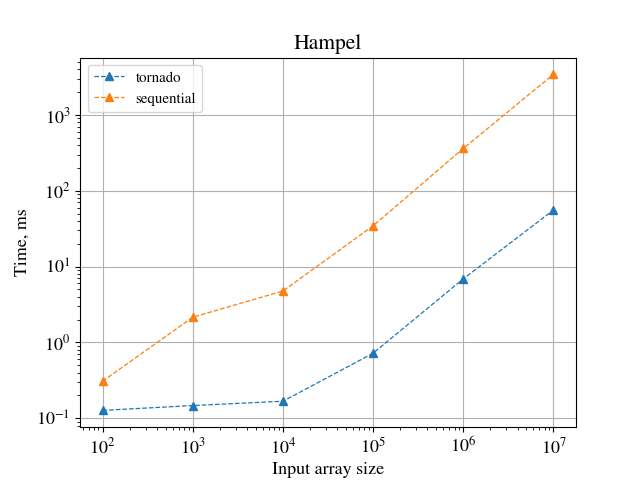

# TornadoVM experiments
This repository contains some experiments made with TornadoVM with GPU support.
 - `Hampel.java` Implementation of the [Hampel filter](https://au.mathworks.com/help/signal/ref/hampel.html)
 - `ReductionAvgFloats.java` Average reduction of a float array
 - `KMeans.java` Implementation of the baseline KMeans algorithm


## How to run
To build your code use one of the commands inside the `build` script, for example:
```
./nvidia_docker_run.sh javac.py Hampel.java
```
To run:
```
./nvidia_docker_run.sh tornado Hampel
```

The directory `opencl_generated/` contains some OpenCL code generated by TornadoVM. The file [generated_sum.c](opencl_generated/generated_sum.c) is analyzed and commented to understand how TornadoVM handles reductions, which are not a trivial task to parallelize on a GPU.
To see the generated code pass the flag `tornado --printKernel` when running the code (OpenCL kernel is generated at runtime, not at compilation time).

## Performance
The directory `perf/` contains some plots of the performances obtained with TornadoVM, compared with the sequential execution by the CPU. For example with Hampel filter:



## Requirements
Docker image of TornadoVM with GPU support, [https://github.com/beehive-lab/docker-tornado](https://github.com/beehive-lab/docker-tornado)

## References
 - [An Introduction to the OpenCL Programming Model](https://cims.nyu.edu/~schlacht/OpenCLModel.pdf)
 - [Efficient Reductions with CUDA](https://developer.download.nvidia.com/assets/cuda/files/reduction.pdf)
